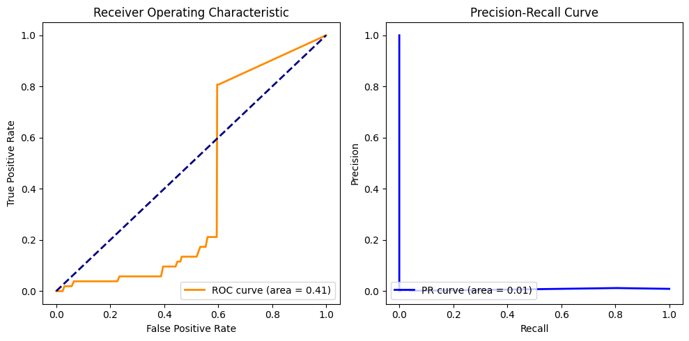
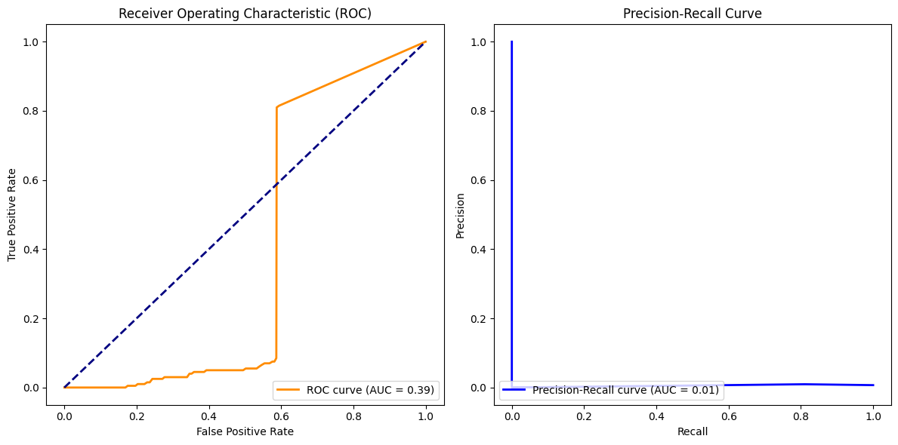

# Machine5


## Contents
* [Project Structure](#project-structure)  
* [Overview](#overview)  
  * [Project Description](#project-description)  
  * [Hypothesis, Scenario](#hypothesis-scenario)  
  * [Results](#results)  
  * [Strong Point](#strong-point)  
* [How to Run](#how-to-run)   
  * [git clone](#1-open-and-run-how_to_runipynb-to-clone-this-repository)  
  * [Feature generation](#2-feature-generation)  
  * [Scenario 1](#3-scenario-1)  
  * [Scenario 2](#4-scenario-2)   
* [Contributors](#contributors)  


## Project Structure

<details>
<summary>Machine5</summary>
<div markdown="1">

  ```
📦Machine5
 ┣ 📂Closed
 ┃ ┣ 📜Closed_RF.ipynb
 ┃ ┣ 📜Closed_RF_old.ipynb
 ┃ ┣ 📜Closed_RF_selected10.ipynb
 ┃ ┣ 📜Closed_SVM.ipynb
 ┃ ┗ 📜baseline.ipynb
 ┣ 📂Open_Binary
 ┃ ┣ 📂baseline
 ┃ ┃ ┗ 📜Open_Binary_KNN.ipynb
 ┃ ┣ 📜Open2_Binary_RF_selected12.ipynb
 ┃ ┣ 📜Open2_Binary_RF_selected6.ipynb
 ┃ ┣ 📜Open_Binary_RF.ipynb
 ┃ ┗ 📜Open_Binary_SVM.ipynb
 ┣ 📂Open_Multi
 ┃ ┣ 📜Open2_Multi_RF.ipynb
 ┃ ┣ 📜Open_Multi_RF.ipynb
 ┃ ┗ 📜Open_Multi_SVM.ipynb
 ┣ 📂datasets
 ┃ ┣ 📜binary_labels.csv
 ┃ ┣ 📜final_labels.csv
 ┃ ┣ 📜mon_features.csv
 ┃ ┣ 📜mon_features_old.csv
 ┃ ┣ 📜mon_labels.csv
 ┃ ┣ 📜unmon3000_features.csv
 ┃ ┣ 📜unmon3000_features_old.csv
 ┃ ┣ 📜unmon_features.csv
 ┃ ┗ 📜unmon_features_old.csv
 ┣ 📂features
 ┃ ┣ 📂feature_information
 ┃ ┃ ┣ 📜combined_feature_information.ipynb
 ┃ ┃ ┣ 📜comimage.png
 ┃ ┃ ┣ 📜comimage2.png
 ┃ ┃ ┣ 📜mon_feature_information.ipynb
 ┃ ┃ ┣ 📜monimage.png
 ┃ ┃ ┣ 📜monimage2.png
 ┃ ┃ ┣ 📜unmon_feature_information.ipynb
 ┃ ┃ ┗ 📜unmonimage.png
 ┃ ┣ 📂original_datasets
 ┃ ┃ ┣ 📜mon_standard.pkl
 ┃ ┃ ┣ 📜unmon_standard10.pkl
 ┃ ┃ ┗ 📜unmon_standard10_3000.pkl
 ┃ ┣ 📜README.md
 ┃ ┗ 📜feature_generator.ipynb
 ┣ 📜README.md
 ┗ 📜how_to_run.ipynb
  ```
</div>
</details>


## Overview
### Project Description
* **Given data**: mon_standard.pkl (data from monitored websites), unmon_standard10.pkl (data from unmonitored websites).
* **Project Purpose**: Based on the given data, create a model that makes the following predictions; label the monitored website instances with {0, 1, 2, ..., 94} and the unmonitored website instances with the label '-1'.
* **Constraints**
  * The model must be selected from LR, NB, SVM, DT, GB, k-NN, Clustering, and NN.
  * Metric must use the following: Accuracy (Closed-World), True positive rate, False positive rate, precision, PR curve, and ROC (Opern-World).


### Hypothesis, Scenario
  * **Candidate Features** 
    * Details: [./features/README.md](https://github.com/440g/Machine5/blob/main/features/README.md)

  * **Closed-Wold Multi, Open-World Binary Classification**
    * Use a baseline model to select the best model that performs well on the given data.
    * Only features with high importance and correlation coefficients are selected for training to avoid overfitting and speed up training.
    * We use data preprocessing and hyperparameter tuning to improve the accuracy of the selected model.   

  * The open-world multi classification followed two scenarios.

  * **Scenario 1**  
    * The model is selected by considering the baseline of multi-classification in the closed world and the baseline of binary classification in the open world.
    * Combine data for monitored and unmonitored instances.
    * Using the selected model, predict the label{-1, 0, 1, ..., 94} for the combined data.

  * **Scenario 2**  
    * Preprocess the data without classification, taking into account the different feature importance and 2. correlation coefficients between monitored and unmonitored data.
    * Train a closed multi-classification model and an open binary classification model for each data separately.
    * Perform prediction of open binary classification model > Extract the prediction result > Perform multi-classification based on this prediction result.  

### Results
  * **Scenario 1**  
    * Multi-classification and binary classification do not consider the importance of the features used, resulting in relatively low accuracy.
    * <details>
      <summary>details(SVM)</summary>
      <div markdown="1">

        Accuracy (Tuned Model): 0.6993    
        Precision: 0.6993  
        Recall: 0.6254  
        Confusion Matrix (Tuned Model):  
        [[1686    3    3 ...    1    0    4]  
        [   7   16    0 ...    0    0    2]  
        [  10    0   31 ...    0    0    0]  
        ...  
        [  14    0    1 ...   17    0    0]  
        [   2    0    0 ...    0   35    0]  
        [   6    0    0 ...    1    0   25]]

        ROC AUC: 0.4105  
        PR AUC: 0.0071  
        
      </div>
      </details>  
    
  * **Scenario 2** 
    * The criteria not considered in Scenario 1 were applied, resulting in a relatively high accuracy. 
    * <details>
      <summary>details(RF)</summary>
      <div markdown="1">

      Accuracy: 0.8136  
      Precision: 0.8657  
      Recall: 0.7885  
      Confusion Matrix:
      

      ROC AUC: 0.3905  
      Model PR AUC: 0.0054  
      
      </div>
      </details>  
    
  * Both open world multi classifications resulted in very low ROC and PR scores because the dataset was highly imbalanced (-1:remaining 95 classes = 10000:19000). 

  * Solution: Techniques such as oversampling/undersampling can be used to balance the classes. Additionally, it is possible to consider weighting samples with smaller clusters.

### Strong Point
  * Calculate features based on findings from prior research papers for a given classification objective and dataset   
  * Calculate feature importance, correlation coefficients, and selection considering the purpose of the model  
  * After selecting a model based on our understanding of the dataset, we implement a baseline model to experimentally verify its practical performance.  
  * Optimal model achieves accuracy of 80 or higher for open world(final) classifications  
  * Identify the cause of ROC and PR score decline due to dataset imbalance issues and propose solutions  


## How to Run 
### 1. Open and run `how_to_run.ipynb` to clone this repository
  * <a href="https://colab.research.google.com/github/440g/Machine5/blob/main/how_to_run.ipynb" target="_parent"></a>

### 2. Feature generation
  * Run `feature_generator.ipynb`(/content/drive/MyDrive/Machine5/featuers) and get `{mon_features, unmon_features, unmon3000_features}.ipynb`(/content/drive/MyDrive/Machine5/datasets)

### 3. Scenario 1
  * Closed: Run `{baseline, Closed_RF, Closed_SVM}.ipynb`(/content/drive/MyDrive/Machine5/Closed) 
  * Open_Binary: Run `{Open_Binary_RF, Open_Binary_SVM}.ipynb`(/content/drive/MyDrive/Machine5/Open_Binary)
  * Open_Multi: Run `{Open_Multi_RF, Open_Multi_SVM}.ipynb`(/content/drive/MyDrive/Machine5/Open_Multi)

### 4. Scenario 2
  * **Open_Binary model should be executed before Open_Multi model**
  * Closed: Run `{baseline, Closed_RF, Closed_SVM}.ipynb`(/content/drive/MyDrive/Machine5/Closed)
  * Open_Binary: Run `Open2_Binary_RF_selected12.ipynb`(/content/drive/MyDrive/Machine5/Open_Binary) and get `binary_labels.csv`(/content/drive/MyDrive/Machine5/datasets)
  * Open_Multi: Run `{Open2_Multi_RF}.ipynb`(/content/drive/MyDrive/Machine5/Open_Multi) and get `final_labels.csv`(/content/drive/MyDrive/Machine5/datasets)


## Contributors
|[Minseo Kim](https://github.com/440g)|[Chaewon Kim](https://github.com/chaewonni)|[Minkyung Song](https://github.com/miikii41)|[Seungyeon Kim](https://github.com/bleuxsy)|[Yeonsu Kim](https://github.com/sooooscode)|
|:---:|:---:|:---:|:---:|:---:|
|Project Management|Open_Binary Model Training & Optimization|Closed Model Training & Optimization|Open_Multi Model Training & Optimization|Result Analysis|
|Feature Engineering|Model Evaluation|Model Evaluation|Model Evaluation|Project Presentation|
---
<details>
<summary>Created the following files; If something goes wrong, contact us!</summary>
<div markdown="1">

|All|[Open_Binary](https://github.com/440g/Machine5/tree/main/Open_Binary)|[Closed](https://github.com/440g/Machine5/tree/main/Closed)|[Open_Multi](https://github.com/440g/Machine5/tree/main/Open_Multi)| -|
|:---:|:---:|:---:|:---:|:---:|
| [features](https://github.com/440g/Machine5/tree/main/features)| [Open_Binary/baseline](https://github.com/440g/Machine5/tree/main/Open_Binary/baseline)| Closed_RF_old.ipynb| Open_Multi_RF.ipynb|  |
| Closed/{baseline, Closed_RF, Closed_RF_selected10}.ipynb| Open_Binary_RF.ipynb| Closed_SVM.ipynb| Open_Multi_SVM.ipynb|  |
| Open_Binary/{Open2_Binary_RF_selected6, Open2_Binary_RF_selected12}.ipynb| Open_Binary_SVM.ipynb|  |  |  |
| Open2_Multi_RF.ipynb| Open_Binary_KNN.ipynb|  |  |  |

</div>
</details>
