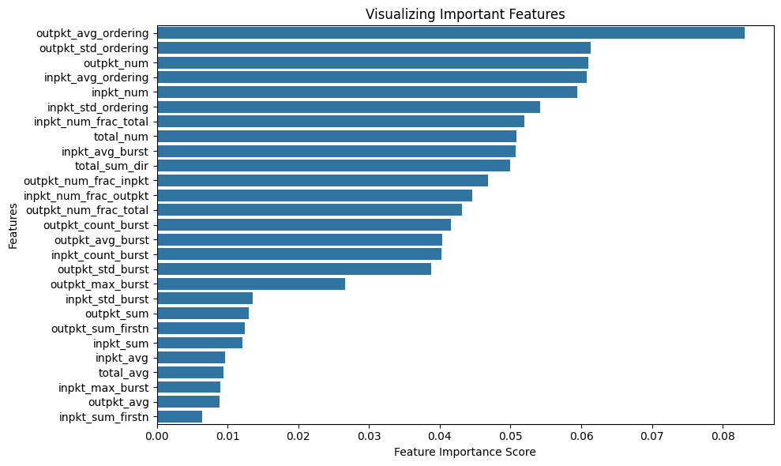
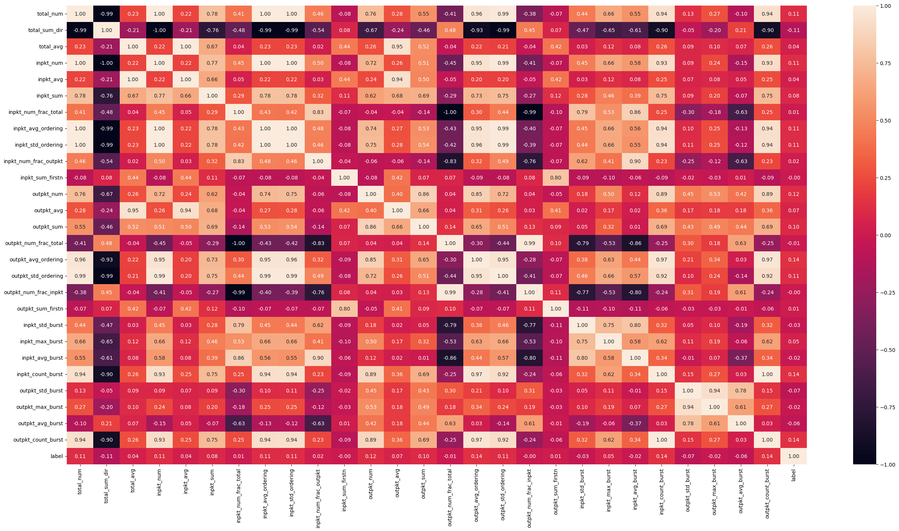
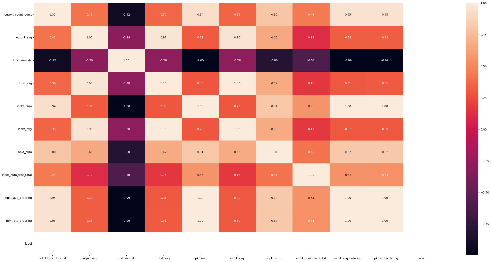
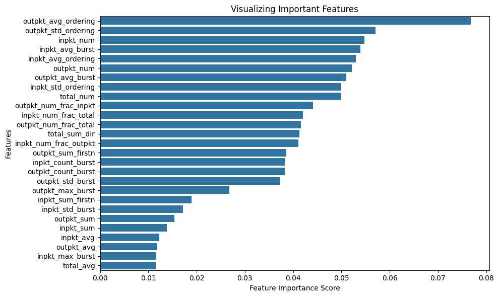
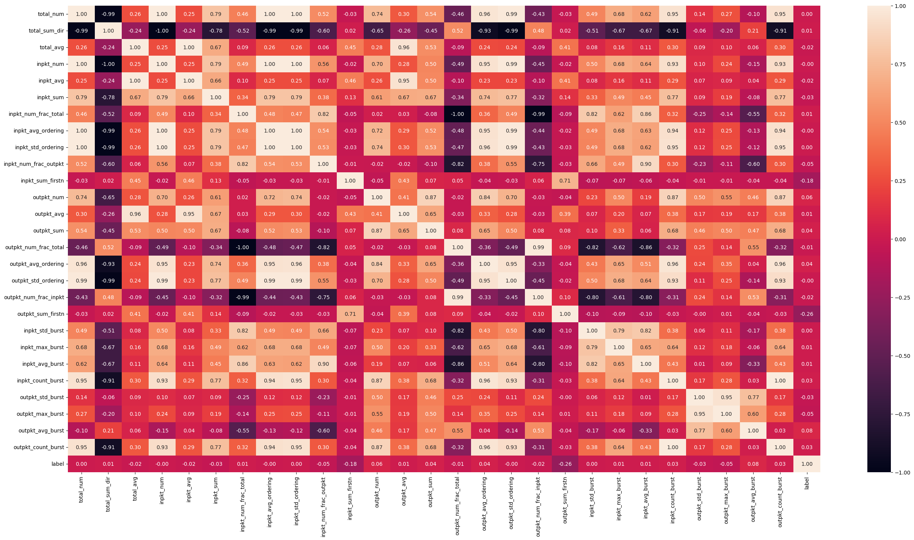

# features
* datasets for the closed world model
  * mon_features.csv : 19000
  * mon_labels.cvs : 19000 
* datasets for the open world model
  * unmon_features.csv : 10000
  * unmon3000_features.csv : 3000

---
## Findings
---
### mon_features
* Feature Importance Score

'outpkt_avg_ordering', 'outpkt_std_ordering', 'outpkt_num', 'inpkt_avg_ordering', 'inpkt_num'
(top 5)
* Feature Correlation

'total_num', 'total_sum_dir', 'inpkt_num', 'inpkt_avg_ordering', 'inpkt_std_ordering', 'outpkt_num', 'outpkt_avg_ordering', 'outpkt_std_ordering', 'inpkt_count_burst', 'outpkt_count_burst'
(label, >0.1)

### unmon_features
* Feature Importance Score
'outpkt_count_burst', 'outpkt_avg', 'total_sum_dir', 'total_avg', 'inpkt_num', 'inpkt_avg', 'inpkt_sum', 'inpkt_num_frac_total', 'inpkt_avg_ordering', 'inpkt_std_ordering'
(top 10)
* Feature Correlation

'total_sum_dir', 'inpkt_num', 'inpkt_sum', 'inpkt_avg_ordering', 'inpkt_std_ordering'
(outpkt_count_burst, >0.6)

### combined_features
* Feature Importance Score

'outpkt_avg_ordering', 'outpkt_std_ordering', 'inpkt_num', 'inpkt_avg_burst' 'inpkt_avg_ordering', 'outpkt_num', 'outpkt_avg_burst', 'inpkt_std_ordering', 'total_num', 'outpkt_num_frac_inpkt'
(top 10)
* Feature Correlation

'inpkt_sum_firstn', 'outpkt_sum_firstn'
(label, >0.1)

more informations are in ./feature_information
---
## Candidat features  
---
### Total packets
1. Total number of packets.
2. Average direction of packets. (i.e., Total sum of packets sign)
3. Average timestamp of packets.
4. ~~Frequency distributions of packet lengths.~~ 
  * total_num
  * total_sum_dir
  * total_avg
  * ~~total_dist_pktlen~~

### Incoming packets
5. Number of incoming packets.
6. Average timestamp of incoming packets.
7. The sum of incoming packets.
8. Number of incoming packets as a fraction of the total number of packets.
9. Average of the incoming packet ordering list.
10. Standard deviation of the incoming packet ordering list.
11. Percentage of incoming packets; the percentage of incoming/outgoing packets rounded in steps of 5. 
12. The sum of incoming packets in the first n packets.
13. Number of incoming packets in the first n packets.
  * inpkt_num
  * inpkt_avg
  * inpkt_sum
  * inpkt_num_frac_total
  * inpkt_avg_ordering
  * inpkt_std_ordering
  * inpkt_num_frac_outpkt
  * inpkt_sum_firstn
  * inpkt_num_firstn

### Outgoing packets
14. Number of outgoing packets.
15. Average timestamp of outgoing packets.
16. The sum of outgoing packets.
17. Number of outgoing packets as a fraction of the total number of packets.
18. Average of the outgoing packet ordering list.
19. Standard deviation of the outgoing packet ordering list.
20. Percentage of outgoing packets; the percentage of outgoing/incoming packets rounded in steps of 5. 
21. The sum of outgoing packets in the first n packets.
22. Number of incoming packets in the first n packets.
  * outpkt_num
  * outpkt_avg
  * outpkt_sum
  * outpkt_num_frac_total
  * outpkt_avg_ordering
  * outpkt_std_ordering
  * outpkt_num_frac_inpkt
  * outpkt_sum_firstn
  * outpkt_num_firttn

### etc. 
~~23. Analyze packets per second~~
  * pkt_avg_sec
  * pkt_std_sec
  * pkt_max_sec
  * inpkt_avg_sec
  * inpkt_std_sec
  * inpkt_max_sec
  * outpkt_avg_sec
  * outpkt_std_sec
  * outpkt_max_sec
24. The distinctive burstiness of traffic
  * inpkt_std_burst 
  * inpkt_max_burst 
  * inpkt_avg_burst
  * inpkt_count_burst 
  * outpkt_std_burst 
  * outpkt_max_burst 
  * outpkt_avg_burst 
  * outpkt_count_burst

