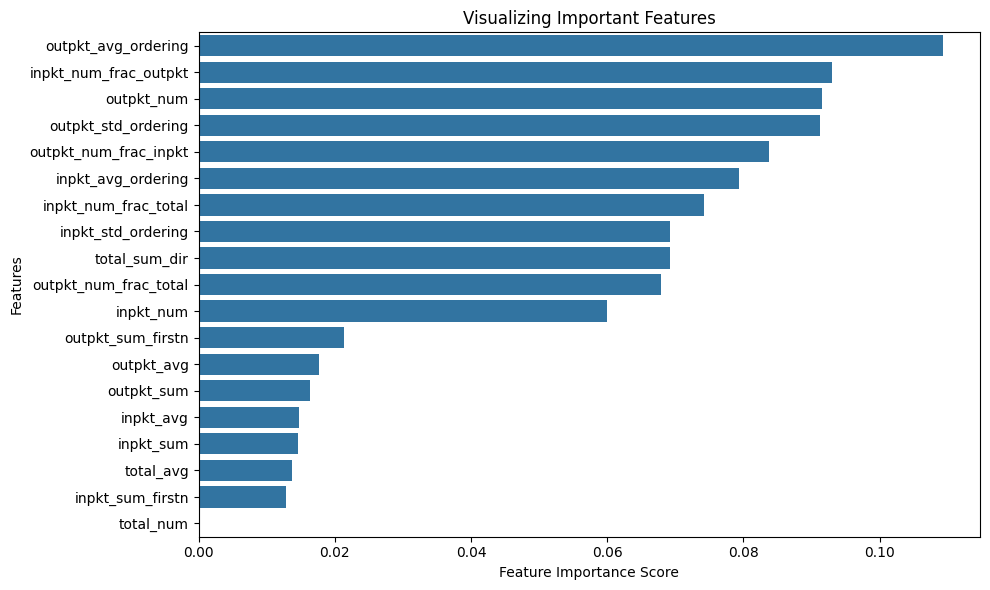

# features
## 데이터 불러오는 법
* 클로즈드 월드용 데이터셋
  * df=pd.read_csv('mon_features.csv') : 19000
  * df=pd.read_cvs('mon_labels.cvs') : 19000 
* 오픈 월드용 데이터셋
  * df=pd.read_csv('unmon_features.csv') : 10000
  * df=pd.read_csv('unmon3000_features.csv') : 3000, colab 리소스 부족할 시 사용

* 참고
  * 클로즈드 월드 데이터 사용해서 RF한 결과치

---
## Candidat features  
* 추후 수정해야 할 부분
  * 피쳐 순서, 숫자 밀림....
  * The distinctive burstiness of traffic 제대로 구현
  * 위 피쳐 값을 토대로 패킷 내 특정 데이터에만 가중치를 줘서 구하는 avg 피쳐도 구현하면 괜찮을 것 같다.

---
### Total packets
1. Total number of packets.
2. Average direction of packets. (i.e., Total sum of packets sign)
3. Average timestamp of packets.
4. ~~Frequency distributions of packet lengths.~~ 전부 똑같다
  * total_num
  * total_sum_dir
  * total_avg
  * ~~total_dist_pktlen~~

### Incoming packets
5. Number of incoming packets.
6. Average timestamp of incoming packets.
7. The sum of incoming packets.
8. Number of incoming packets as a fraction of the total number of packets.
9. Average of the incoming packet ordering list.
10. Standard deviation of the incoming packet ordering list.
11. Percentage of incoming packets; the percentage of incoming/outgoing packets rounded in steps of 5. 
12. The sum of incoming packets in the first n packets.
13. Number of incoming packets in the first n packets.
  * inpkt_num
  * inpkt_avg
  * inpkt_sum
  * inpkt_num_frac_total
  * inpkt_avg_ordering
  * inpkt_std_ordering
  * inpkt_num_frac_outpkt
  * inpkt_sum_firstn
  * inpkt_num_firstn

### Outgoing packets
14. Number of outgoing packets.
15. Average timestamp of outgoing packets.
16. The sum of outgoing packets.
17. Number of outgoing packets as a fraction of the total number of packets.
18. Average of the outgoing packet ordering list.
19. Standard deviation of the outgoing packet ordering list.
20. Percentage of outgoing packets; the percentage of outgoing/incoming packets rounded in steps of 5. 
21. The sum of outgoing packets in the first n packets.
22. Number of incoming packets in the first n packets.
  * outpkt_num
  * outpkt_avg
  * outpkt_sum
  * outpkt_num_frac_total
  * outpkt_avg_ordering
  * outpkt_std_ordering
  * outpkt_num_frac_inpkt
  * outpkt_sum_firstn
  * outpkt_num_firttn

### etc. 
23. Analyze packets per second.
  * 수정중
  * pkt_avg_sec
  * pkt_std_sec
  * pkt_max_sec
  * inpkt_avg_sec
  * inpkt_std_sec
  * inpkt_max_sec
  * outpkt_avg_sec
  * outpkt_std_sec
  * outpkt_max_sec
24. The distinctive burstiness of traffic
  * 추후 구현

